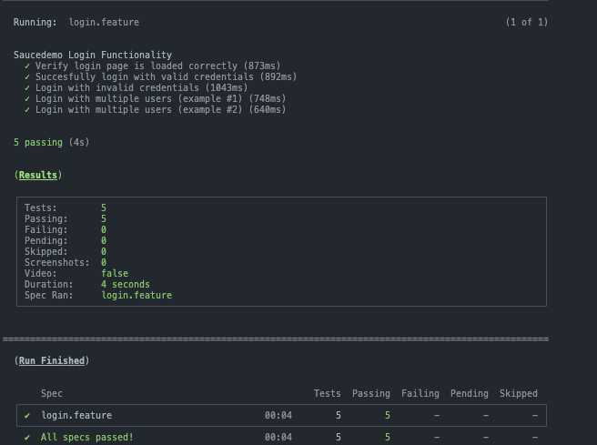

# Cypress E2E Test Automation Framework
[](https://www.cypress.io/)
[](https://cucumber.io/)
[](https://nodejs.org)
[](https://opensource.org/licenses/MIT)

A robust end-to-end testing framework built with Cypress for automated web application testing. This framework provides a scalable structure for UI automation testing with support for multiple environments, custom commands, and comprehensive reporting.
<p align="left">
  
</p>

## 📋 Table of Contents

- [Prerequisites](#-prerequisites)
- [Installation](#-installation)
- [Project Structure](#-project-structure)
- [Configuration](#-configuration)
- [Running Tests](#-running-tests)
- [Troubleshooting](#-troubleshooting)
- [Contributing](#-contributing)

## 🔧 Prerequisites

Before you begin, ensure you have the following installed:

- **Node.js** (v18.0.0 or higher) - [Download & Install Node.js](https://nodejs.org/)
- **npm** (v8.0.0 or higher) or **yarn** (v1.22.0 or higher)
- **Git** - [Download & Install Git](https://git-scm.com/)

Verify installations:
```bash
node --version
npm --version
git --version
```

## 🚀 Installation

### 1. Clone the Repository

```bash
git clone https://github.com/your-organization/cypress-automation.git
cd cypress-automation
```

### 2. Install Dependencies

Using npm:
```bash
npm install
```

### 2.1 Install Cucumber Preprocessor

```bash
npm install --save-dev @badeball/cypress-cucumber-preprocessor
npm install --save-dev @bahmutov/cypress-esbuild-preprocessor

OPTIONAL:
npm install -D cypress-xpath
```

### 3. Verify Installation

Open Cypress Test Runner:
```bash
npm run cy:open
```

## 📁 Project Structure
  ```bash
      cypress-bdd-automation/
    ├── cypress/
    │   ├── e2e/
    │   │   ├── features/              # Gherkin feature files
    │   │   │   └── login.feature
    │   │   └── step_definitions/      # Step implementations
    │   │       └── loginSteps.js
    │   ├── fixtures/                  # Test data (JSON)
    │   │   └── users.json
    │   ├── support/
    │   │   ├── pages/                 # Page Object Model
    │   │   │   └── LoginPage.js
    │   │   ├── commands.js            # Custom commands
    │   │   └── e2e.js                 # Global configuration
    │   ├── screenshots/               # Failure screenshots
    │   └── videos/                    # Test recordings
    ├── cypress.config.js              # Main configuration
    ├── package.json
    └── README.md
  ```

## ⚙️ Configuration
  The main configuration file `cypress.config.js` contains.

### Environment Setup

1. Copy the environment template:
```bash
cp .env.example .env
```

2. Update `.env` with your environment-specific values:
```env
BASE_URL=https://www.saucedemo.com
API_URL=https://api.example.com
TEST_USERNAME=standard_user
TEST_PASSWORD=secret_sauce
```

## 🧪 Running Tests

### Interactive Mode (Cypress Test Runner)

```bash
  # Open Cypress Test Runner
  npm run cy:open

  # Open specific environment
  npm run cy:open:dev
```

### Headless Mode (Command Line)

```bash
  # Run all feature files
  npm run cy:run

  # Run specific feature file
  npm run cy:run -- --spec "cypress/e2e/features/login.feature"

  # Run with specific browser
  npm run cy:run -- --browser chrome
  npm run cy:run -- --browser firefox
  npm run cy:run -- --browser edge

```
### Parallel Execution

```bash
# Run tests in parallel (requires Cypress Cloud)
npm run cy:run:parallel
```

### Custom Commands

Located in `cypress/support/commands.js`:

```javascript
// Login command
Cypress.Commands.add('login', (username, password) => {
  cy.session([username, password], () => {
    cy.visit('/login')
    cy.get('[data-test="username"]').type(username)
    cy.get('[data-test="password"]').type(password)
    cy.get('[data-test="login-button"]').click()
  })
})

// Usage in tests
cy.login('standard_user', 'secret_sauce')
```

### Using Fixtures

```javascript
describe('Data-Driven Tests', () => {
  it('should validate user data', () => {
    cy.fixture('users').then((users) => {
      cy.login(users.validUser.username, users.validUser.password)
    })
  })
})
```

## 📊 Reporting

### Mochawesome Reports

Generate HTML reports after test execution:

```bash
# Run tests with reporting
npm run test:report

# Generate combined report
npm run report:generate
```

Reports are available in the `reports/` directory.

### Allure Reports

```bash
# Run tests with Allure
npm run cy:run:allure

# Generate Allure report
npm run allure:generate

# Open Allure report
npm run allure:open
```

## 🐛 Troubleshooting

### Common Issues and Solutions

#### 1. Tests failing due to timeouts
```javascript
// Increase timeout for specific command
cy.get('.slow-element', { timeout: 15000 })

// Global timeout configuration
defaultCommandTimeout: 15000
```

#### 2. Element not found errors
```javascript
// Wait for element to be visible
cy.get('.element').should('be.visible')

// Use proper waiting strategies
cy.intercept('GET', '/api/data').as('getData')
cy.wait('@getData')
```

#### 3. Cross-origin errors
```javascript
// In cypress.config.js
experimentalSessionAndOrigin: true
chromeWebSecurity: false
```

### Debug Mode

```bash
# Run with debug logs
DEBUG=cypress:* npm run cy:run

# Run specific test with logs
npm run cy:open -- --config video=false
```

## 🤝 Contributing

1. Fork the repository
2. Create your feature branch (`git checkout -b feature/AmazingFeature`)
3. Commit your changes (`git commit -m 'Add some AmazingFeature'`)
4. Push to the branch (`git push origin feature/AmazingFeature`)
5. Open a Pull Request

### Coding Standards

- Follow [JavaScript Standard Style](https://standardjs.com/)
- Use ESLint for code quality
- Maintain test coverage above 80%


## 📚 Resources
- [Cypress Documentation](https://docs.cypress.io)
- [Cypress Best Practices](https://docs.cypress.io/guides/references/best-practices)
- [Cypress Real World App](https://github.com/cypress-io/cypress-realworld-app)
- [Cypress Discord Community](https://discord.gg/cypress)

## 📄 License
This project is licensed under the MIT License - see the [LICENSE](LICENSE) file for details.

## 👥 Team
- **QA Lead**: [Özge Büyüktorun](mailto:ozgebuyuktorun@outlook.com)
- **Automation Engineers**: [Team Email](mailto:ozgebuyutorun@outlook.com)

---
**Last Updated**: September 2025  
**Version**: 1.0.0  
**Status**: Active Development